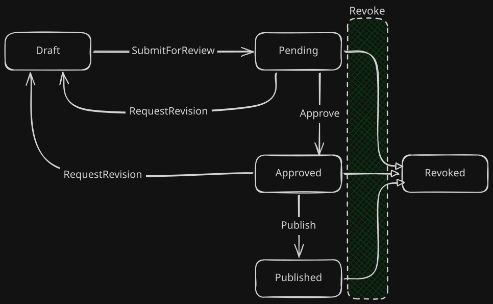

# StangaNetLib.ContentFlow

[](https://github.com/StangaNet/StangaNetLib.ContentFlow/actions/workflows/main.yml)


StangaNetLib.ContentFlow is a domain-driven lifecycle state machine for .NET. It provides a structured workflow for managing content items through lifecycle transitions (e.g., `Draft` → `Pending` → `Approved` → `Published` → `Revoked`), backed by an immutable audit trail and a background scheduler for automatic publishing and expiry.

## Design Philosophy

- **Domain-Centric**: Organized around functional domains (Workflow, Content, Audit) rather than technical layers.
- **Functional Error Handling**: Uses the `Result<T>` pattern to manage domain failures as data, avoiding exception-based control flow.
- **Background Scheduling**: Integrated support for time-based state transitions via a managed background service.
- **Modern Standards**: Fully optimized for .NET 8.0 and 9.0, utilizing modern C# features like `record` types and `TimeProvider`.

## Installation

The package is hosted on **GitHub Packages**.

```xml
<!-- NuGet.config — add the GitHub Packages source -->
<configuration>
  <packageSources>
    <add key="github" value="https://nuget.pkg.github.com/StangaNet/index.json" />
  </packageSources>
</configuration>
```

```xml
<!-- .csproj -->
<PackageReference Include="StangaNetLib.ContentFlow" Version="1.0.0" />
```

---

## Core Components

*The library is organized into functional namespaces. For implementation details, refer directly to the source code.*

| Namespace | Core Components | Purpose |
| :--- | :--- | :--- |
| `StangaNetLib.ContentFlow.Workflow` | `IContentWorkflowService<T>`, `IContentScheduleProcessor` | Lifecycle state machine and scheduling logic. |
| `StangaNetLib.ContentFlow.Content` | `IContentRepository<T>`, `ContentItem<T>`, `ContentState` | Domain models and persistence abstractions. |
| `StangaNetLib.ContentFlow.Auditing` | `IContentReviewLogRepository`, `ContentReviewLog` | Immutable audit trail for all transitions. |
| `StangaNetLib.ContentFlow.Configuration` | `ContentFlowSettings` | Configuration and validation logic. |
| `StangaNetLib.ContentFlow.Exceptions` | `ContentFlowErrors` | Structured domain error catalogue. |
| `StangaNetLib.ContentFlow.Extensions` | `ServiceCollectionExtensions` | Dependency Injection registration. |

---

## Project Structure

```
StangaNetLib.ContentFlow/
├── build/
│   └── StangaNetLib.ContentFlow.props  # MSBuild auto-import — injects AssemblyMetadata
├── src/
│   └── StangaNetLib.ContentFlow/
│       ├── Auditing/       # IContentReviewLogRepository, ContentReviewLog
│       ├── Configuration/  # ContentFlowSettings, ContentFlowSettingsValidator
│       ├── Content/        # IContentRepository, ContentItem, ContentState, InMemoryContentRepository
│       ├── Exceptions/     # ContentFlowErrors
│       ├── Extensions/     # ServiceCollectionExtensions
│       └── Workflow/       # IContentWorkflowService, ContentWorkflowService, ContentTransitionRules, etc.
└── tests/
    └── StangaNetLib.ContentFlow.Tests/
```

---

## Quick Start

### Configuration
Define your settings in `appsettings.json`:

```json
{
  "ContentFlowSettings": {
    "ScheduleCheckInterval": "00:00:30",
    "SchedulerActorName": "system"
  }
}
```

### Registration
Register the services in your `Program.cs`:

```csharp
builder.Services.AddStangaNetLibContentFlow(builder.Configuration);

// Enroll content types in the background scheduler:
builder.Services.AddStangaNetLibContentFlowType<Article>();
builder.Services.AddStangaNetLibContentFlowType<BlogPost>();
```

### Usage Example

```csharp
public class ArticleService
{
    private readonly IContentWorkflowService<Article> _workflow;

    public ArticleService(IContentWorkflowService<Article> workflow)
        => _workflow = workflow;

    public async Task<Result<ContentItem<Article>>> DraftAsync(Article article)
        => await _workflow.CreateAsync(article);

    public async Task<Result<ContentItem<Article>>> SubmitAsync(Guid id, string author)
        => await _workflow.SubmitForReviewAsync(id, author);

    public async Task<Result<ContentItem<Article>>> PublishAsync(Guid id, string editor)
        => await _workflow.PublishAsync(id, editor);
}
```

## State Machine




| Transition | Method |
| :--- | :--- |
| Draft → Pending | `SubmitForReviewAsync` |
| Pending → Approved | `ApproveAsync` |
| Pending / Approved → Draft | `RequestRevisionAsync` |
| Approved → Published | `PublishAsync` |
| Approved → Published (future) | `SchedulePublishAsync` |
| Any → Revoked | `RevokeAsync` |
